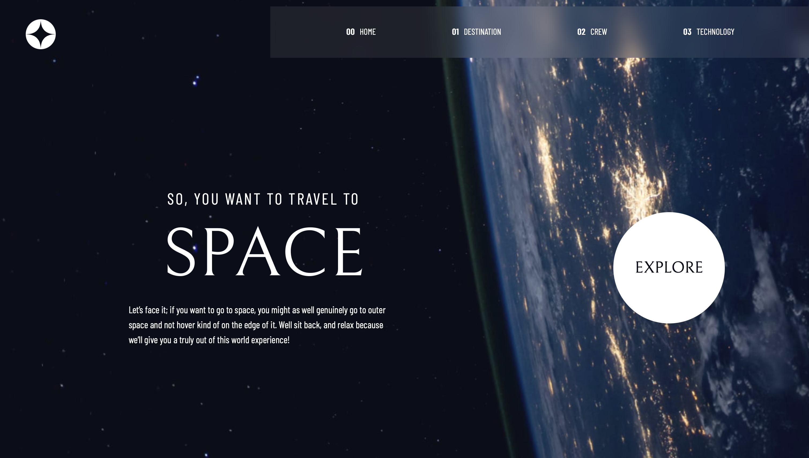
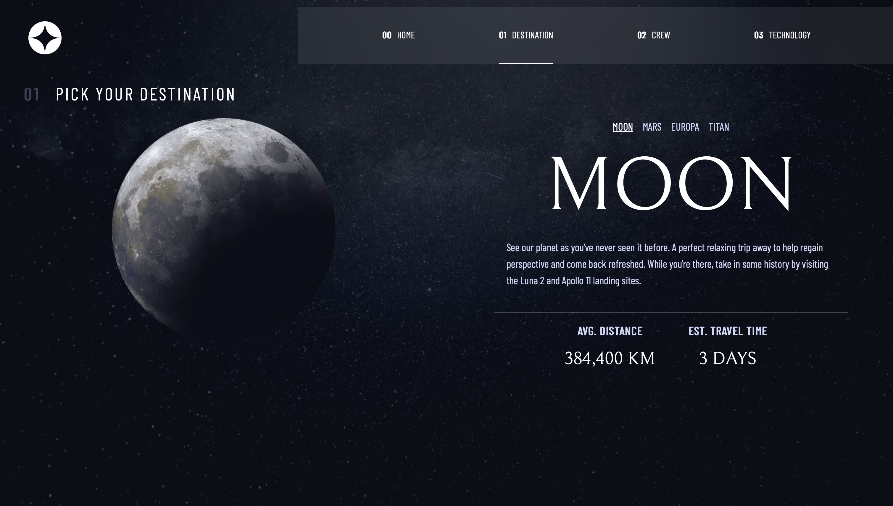
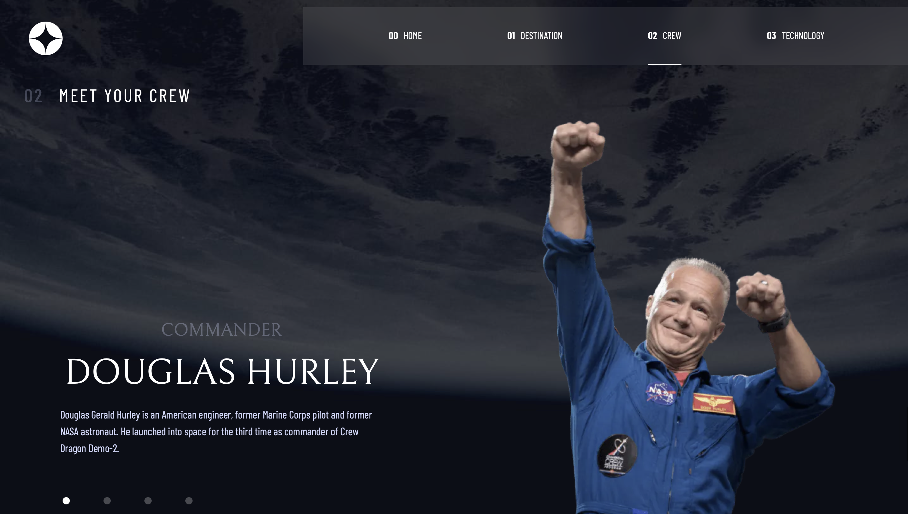
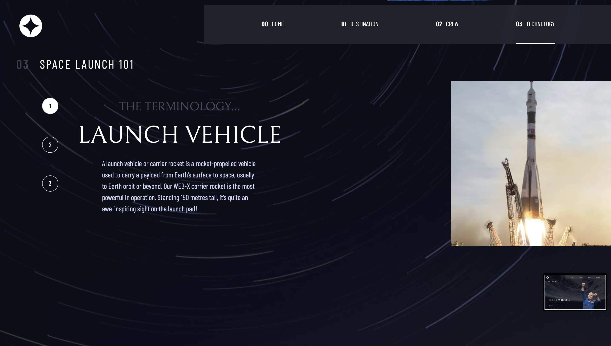

# Frontend Mentor - Space Tourism Website

## About the Project: 📚
This is a Frontend Mentor project, the aim is to build out this multi-page space tourism website and get it looking as close to the design as possible.

Design preview for the Clipboard landing page coding challenge:

## Live Demo of the Project: 📹

[Space Tourism Website](https://space-tourism-website-tugbaesat.vercel.app)

## Technologies, Frameworks and Libraries: ☕️ 🐍 ⚛️
- [Next.js](https://nextjs.org/)
- [React](https://react.dev/)
- [Tailwind CSS](https://tailwindcss.com/)

## Screenshots: 📷

## Authors: 💻
[@tugbaesat](https://github.com/tugbaesat)
